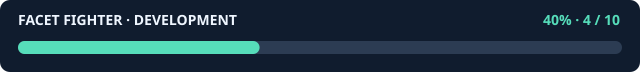

# FACET FIGHTER — PlayStation 1

**進捗: 50% — 10項目中5項目を検証済み。** PS1 ビルドと人体の描画を確認。対戦・サウンドの検証とモデル改善を進行中。完成後にタグ・Release を公開します。

**開発モデル: GPT-6 Astra** — Codex 上で段階的に開発し、タスク単位で commit & push しています。ユーザーの指示履歴は [PROMPTS.md](PROMPTS.md) に時刻付きで記録します。

An original flat-shaded 3D fighting game for the original PlayStation, inspired by early polygonal arcade fighters. All fighters, geometry and presentation are original.

## Planned game

- Articulated low-poly fighters on an open, raised square arena.
- Punch / kick / guard controls, crouching, jumping, throws and high/mid/low attacks.
- Knockouts, ring-outs, 30-second rounds, first to two round wins; health decides time-outs and equal health draws replay.
- CPU arcade matches and local two-controller versus, character selection, pause and rematch.
- Native PS1 executable and BIN/CUE disc image, procedural sound effects.

## Development steps

1. Repository and explicit acceptance criteria.
2. Portable deterministic combat simulation and rule tests.
3. Native PS1 renderer, animated polygon fighters, controls and match menus.
4. Sound, tuning and integration verification.
5. Emulator acceptance run, distributable image and documented results.

Each completed step is committed and pushed separately. Completion is tracked in [docs/STATUS.md](docs/STATUS.md); the specification above is the target, not a claim that it is all implemented.

## Tools

PS1 code uses [PSn00bSDK](https://github.com/Lameguy64/PSn00bSDK). PS1 builds run on GitHub Actions. Portable rule tests run on the development machine using a C compiler.

No BIOS, commercial game assets or SDK binaries are included.

Run portable rule tests with `./tools/test.sh`.

## 最新の実行画面

GitHub Actions の `a61662a` ビルドを DuckStation で実行。画面はキャラクター選択。実機確認とは区別しています。

[スクリーンショット付き実装履歴](docs/IMPLEMENTATION.md)
