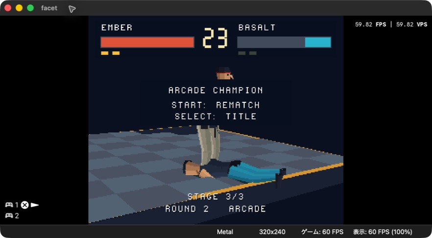

# FACET FIGHTER — PlayStation 1

[](docs/STATUS.md)

**進捗: 100% — 10項目中10項目を完了。** 全3ステージクリア・2P操作・SPU音声をエミュレーターで確認。[v0.1.0をダウンロード](https://github.com/GOROman/gpt-6-astra-ps1-game-benchmark/releases/tag/v0.1.0)。

**開発モデル: GPT-6 Astra** — Codex 上で段階的に開発し、タスク単位で commit & push しています。ユーザーの指示履歴は [PROMPTS.md](PROMPTS.md) に時刻付きで記録します。

An original flat-shaded 3D fighting game for the original PlayStation, inspired by early polygonal arcade fighters. All fighters, geometry and presentation are original.

## Game

- Articulated low-poly fighters on an open, raised square arena.
- Punch / kick / guard controls, crouching, jumping, throws and high/mid/low attacks.
- Knockouts, ring-outs, 30-second rounds, first to two round wins; health decides time-outs and equal health draws replay.
- CPU arcade matches and local two-controller versus, character selection, pause and rematch.
- Native PS1 executable and BIN/CUE disc image, procedural sound effects.

## Development steps

1. Repository and explicit acceptance criteria.
2. Portable deterministic combat simulation and rule tests.
3. Native PS1 renderer, animated polygon fighters, controls and match menus.
4. Sound, tuning and integration verification.
5. Emulator acceptance run, distributable image and documented results.

Each completed step is committed and pushed separately. Verification scope is recorded in [docs/STATUS.md](docs/STATUS.md). Version 0.1.0 is released; physical-console validation remains separate.

## Tools

PS1 code uses [PSn00bSDK](https://github.com/Lameguy64/PSn00bSDK). PS1 builds run on GitHub Actions. Portable rule tests run on the development machine using a C compiler.

No BIOS, commercial game assets or SDK binaries are included.

Run portable rule tests with `./tools/test.sh`.

## 最新の実行画面



アーケード全3ステージをクリアし、2番パッドのキャラ選択・移動・打撃・ポーズ、しゃがみ回避とバックステップを確認。通しクリア **3,777フレーム** と同キャラ2P戦 **3,197フレーム** は、合計 **6,974フレームで処理落ち0回**（各描画1 VBlank）。[最終計測ログ](docs/frame-audit-final.txt)。物理PS1・物理コントローラーは未試験です。

[スクリーンショット付き実装履歴](docs/IMPLEMENTATION.md)

## 操作

| ボタン | 操作 |
|---|---|
| 左右 | 移動 |
| 下 / 上 | しゃがむ / ジャンプ |
| □ / △ / × | パンチ / キック / ガード |
| ○ または □+× | 投げ |
| 下+△ / □+△ | 下段キック / ヘビーキック |
| R2 | 鉄山靠系ショルダータックル（中段・踏み込み・ダウン） |
| L1 / R1 | 相手の周りを移動 |
| L2 / 後ろ方向2回 | バックステップ |
| START | 決定 / ポーズ |
| ポーズ中 SELECT | タイトルへ戻る |

立ちガードは上・中段、しゃがみガードは下段を防ぎます。投げは立ちガードを崩し、しゃがみで回避できます。ショルダータックルは近距離から踏み込み、相手を大きく押し出します。立ちガードで防げます。

## ビルド・起動

PS1 ビルドは GitHub Actions の **PS1 build** で行います。Push ごとに戦闘テストを実行し、固定版 PSn00bSDK v0.24 で `facet.exe` と `facet.bin` / `facet.cue` を生成します。

```sh
# ローカルで戦闘ルールを検証
./tools/test.sh

# 手動で GitHub Actions を起動
gh workflow run build.yml
gh run list --workflow build.yml

# 成功した run ID の成果物を取得（ID を実際の番号に置き換える）
gh run download RUN_ID -n facet-ps1 -D build/download
```

`facet.cue` を、同じフォルダに `facet.bin` を置いた状態で DuckStation に読み込みます。更新時は既存の1インスタンスで再読み込み／ゲーム再起動を使用します。完成後に `v*` タグを作成すると、Actions がタグのソースを再ビルドして Release に ZIP・BIN/CUE・EXE・チェックサムを公開します。現時点では受け入れ検証中です。

[エミュレーターで録音した効果音（18秒・FLAC）](docs/audio/facet-impact-demo.flac)

打撃時は3フレーム、強打は6フレームのヒットストップ。ガード時は2フレーム。接触位置の火花とダメージに応じた画面揺れを表示します。構え・しゃがみ・攻撃は関節角度を補間し、手足の長さを維持します。
