# 実装履歴

スクリーンショットは実際の PS1 ビルドを DuckStation で実行して取得。画像が存在しない過去工程には後から画像を捏造しません。コミット ID はソースの版を示します。

| Commit | タスク | 確認 |
|---|---|---|
| `53ead6a` | 仕様・公開リポジトリ | Public / Push |
| `f20ba90` | 戦闘処理・ルールテスト | ASan / UBSan、20,000フレーム |
| `fdc66b4` | PS1 描画・メニュー・Actions | EXE / BIN / CUE ビルド成功 |
| `58c8365` | README 進捗バー | 検証済み項目数を表示 |
| `f931f49` | GPT-6 Astra 表記・指示ログ | PROMPTS.md |
| `6d1f0a0` | カメラ投影修正 | 下記の修正前後画像 |
| `a61662a` | SPU 効果音生成 | Actions ビルド成功。音の検証は継続 |

## カメラ投影修正 — 2026-09-05

修正前 (`fdc66b4`) は床の投影方向が逆で人体が床に隠れていた。

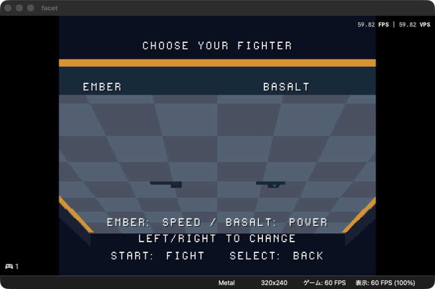

修正後 (`a61662a`、カメラ修正 `6d1f0a0` を含む)。人体とリングを約60 FPSで描画。現在は四角柱の基本モデルで、次にポリゴン数と輪郭を改善する。

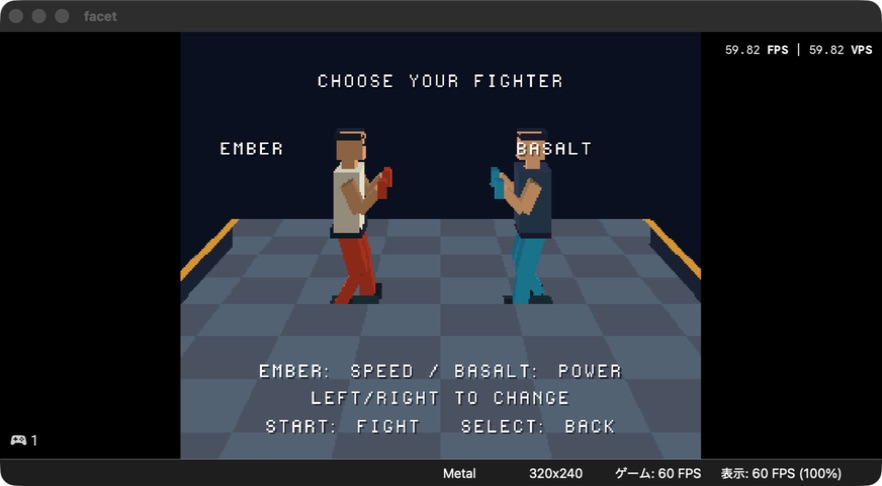

以降、エミュレーターは1インスタンスを再読み込みして確認する。

## 人体のポリゴン増量 — 2026-09-05

`45e97b3`: 四角柱を8角断面のテーパー形状に変更。胴体を肩・胸・腰の3段に分け、手足も関節へ向けて細くした。各部品は12三角形相当から28三角形相当へ増量。

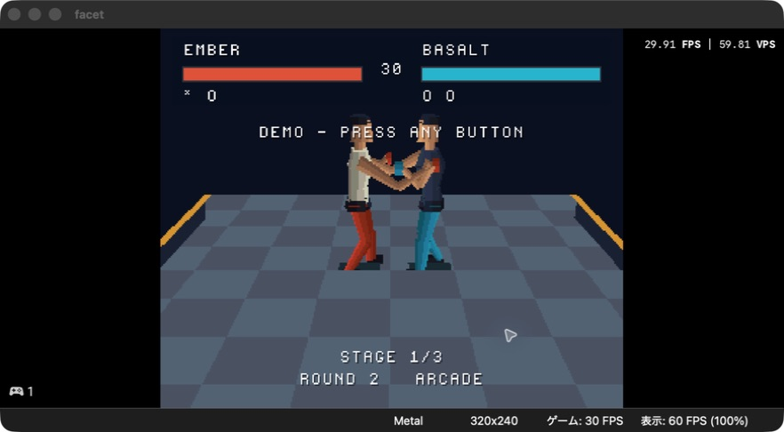

実測30 FPS（表示60 VPS）。見た目は確認できたが高速化が必要。後続コミットで各頂点の投影を面間で共有している。

## 新カメラ・HUD・鉄山靠・腕・60 FPS — 2026-09-05

| Commit | タスク |
|---|---|
| `fd3b7de` | 頂点の投影結果を共有 |
| `966c459` | 周回・ラウンド導入・追従・勝者へのカメラ |
| `7be7979` | 画面上部のライフゲージと大きなタイマー |
| `41e9960` | R2 の鉄山靠系ショルダータックル |
| `b4d4a3e` | 腕を固定長にし、肘の角度でパンチを表現 |
| `35693d7` | 裏面除外・投影の演算範囲修正 |
| `67bb7b8` | 攻撃硬直・ラウンド待機短縮、VBlank基準の更新 |
| `f556430` | 胴着・帯・拳・顔の輪郭を改善 |

以下は上記を含む `f556430` の統合実行画面（各過去コミットの画面という意味ではない）。CPU対戦で **59.82 FPS / 59.82 VPS** を観測。増量モデルを減らさず60 FPSへ復帰。Actions のルールテストと PS1 ビルドも成功。

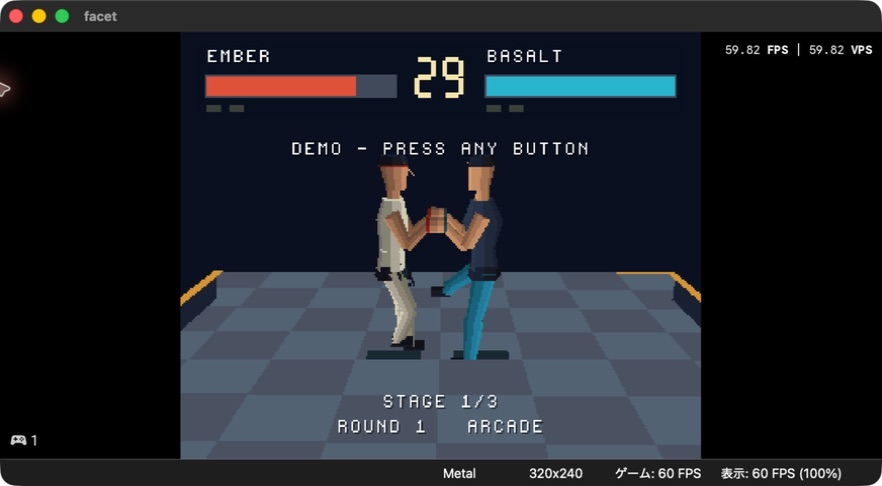

[Actions build 33927965929](https://github.com/GOROman/gpt-6-astra-ps1-game-benchmark/actions/runs/33927965929)。エミュレーター1インスタンス内で CUE を再読み込み。持続的な最悪条件の性能確認、2P操作、全メニューとサウンドの受け入れ検証は引き続き必要。

## SPU音声の録音検証 — 2026-09-05

`f556430` のCPU対戦を同じDuckStationインスタンスで70.615秒録音。44.1kHzステレオPCMの非ゼロ出力を確認。攻撃・衝突・ラウンド音をコードと出力信号で確認した。物理スピーカー／PS1実機の確認ではない。

[録音の18秒抜粋（FLAC）](audio/facet-spu-demo.flac)

## 打撃音へ変更 — 2026-09-05

`1934f49`: 短いノイズ衝撃と減衰する低域の胴鳴りを合成。空振りは風切り音、ガードは硬い接触音に分離。ADPCMの終端と減衰をテスト。Actions run 33929127433 が成功。

同じエミュレーターで再起動後、53.881秒のステレオ音声を録音（ピーク11,443、RMS1,307.27）。[新しい打撃音の18秒抜粋](audio/facet-impact-demo.flac)。

## 回避・命中演出・補間 — 2026-09-05

- `3ca1651`: L2と後ろ2回によるバックステップ、しゃがみ保持のテスト。
- `daa4caf`: 弱打3／強打6／ガード2フレームの停止。タイマー・位置・攻撃フレームの停止と再開を検証。接触位置の火花と強度別の揺れ。
- モーション補間: 関節角度の補間、滑らかな出し戻し、しゃがみ・ガード・転倒の遷移。腕と脚を固定長に維持。

戦闘・音声のホストテストは通過。追加演出を含む実行スクリーンショットと60 FPS確認は後続の検証で追記する。

## 追加演出版の実行確認 — 2026-09-05

`53abc22`（`515da97`の補間とそれ以前の回避・命中演出を含む）。Actions run 33929985221 が成功。既存の1インスタンス内でゲームを閉じ、更新CUEを開き直した。CPU対戦のしゃがみ、キック、接触位置の火花とKOを視認。対戦／KO時に59.82 FPSを観測。

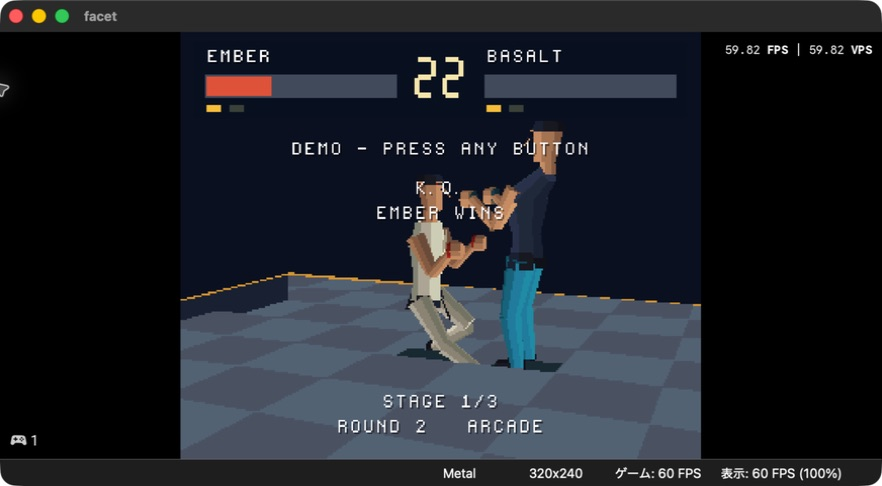

スクリーンショットはKOの瞬間。ヒットストップの停止フレーム数とタイマー停止はホストテストで検証。動画全フレームの性能監査や2P実操作の完了を示すものではない。

## 操作検証の切り分け — 2026-09-05

- 操作一覧を追加した結果、HOW TO PLAY の末尾とルール説明が重なる座標になっていたため、ルールを下へ移動。
- BIOS パッド応答の接続状態・ID・ボタン変化だけを開発ログへ出力。入力自体を置き換えず、ホストキー入力とPS1側の受信を切り分ける。
- この時点ではタイトルからの手動対戦・2P操作の確認は未完了。

### 継続フレーム計測

600描画フレームごとに、実際に経過したVBlank数、2VBlank以上かかったフレーム数、最大間隔をTTYへ記録。シミュレーションの追いつき処理が間隔を丸める前に計測する。`frames=600 vblanks=600 slow=0 max=1` が、その区間のネイティブNTSC描画レート維持を示す。ホスト側の実時間速度は別途エミュレーター表示で確認する。

入力切り分け: `bc42feb` で1番パッドの `status=00 id=41 buttons=0000`、2番の未接続 `status=ff` を確認。自動キー入力時のボタン変化はまだ観測できていない。

### 継続計測の初回結果 (`83a2c80`)

[Actions run 33930991567](https://github.com/GOROman/gpt-6-astra-ps1-game-benchmark/actions/runs/33930991567) 成功。既存の1インスタンスでCUEを開き直して計測。連続7区間、計4,200描画フレームで9回の2VBlank間隔を検出。スクショの59.82 FPSだけでは全フレーム維持を証明できない。診断ログの出力負荷を含めた原因切り分けが必要。

[計測ログ](frame-audit.txt)

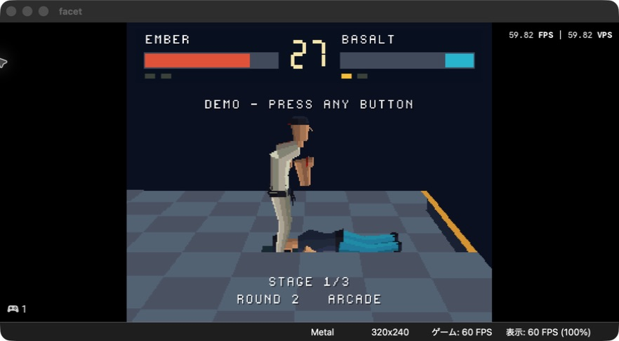

### 対戦中の同期ログを撤去

初回計測ではTTYへ600フレームごとに同期出力していた。計測自身の負荷を避けるため、対戦中はカウンター加算だけにし、PLAYから離れた時にまとめて出力する。ラウンド遷移ログと対戦中のパッド変化ログも止めた。計測区間は対戦の全描画間隔で、遅いフレームを除外しない。入力診断はメニュー画面では引き続き有効。

### メニューからの対戦操作とポーズ修正

DuckStationの保持型STARTマクロでPS1側の`0008`を受信。タイトル→キャラクター選択→アーケード対戦→ポーズ→解除→結果→再戦を実際のパッド入力経路で確認した。短い自動キー入力では受信を観測できなかったが、押下保持で操作できる。

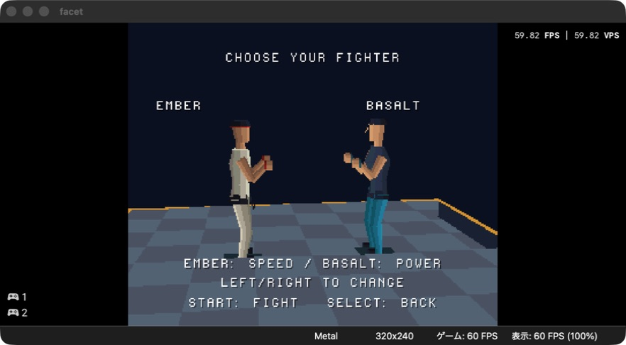

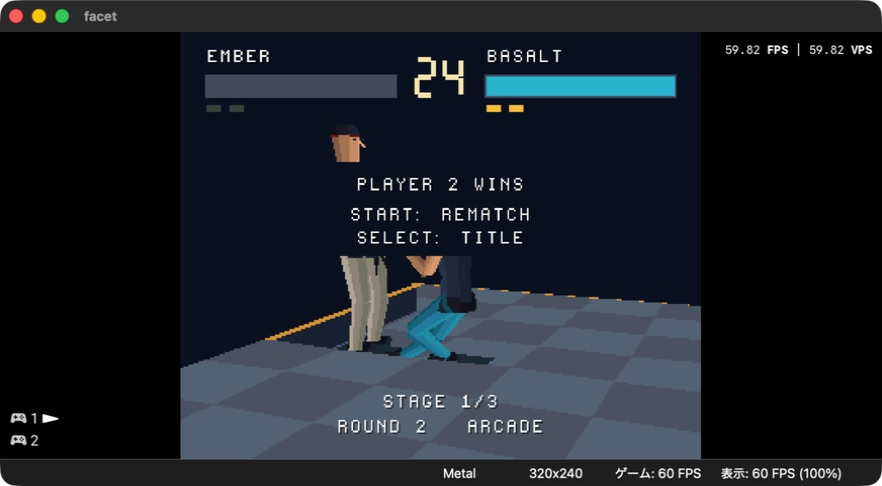

KO中のポーズでラウンド告知とポーズ文面が重なることを発見。ポーズ／結果表示時にはラウンド告知を描かないよう修正する。

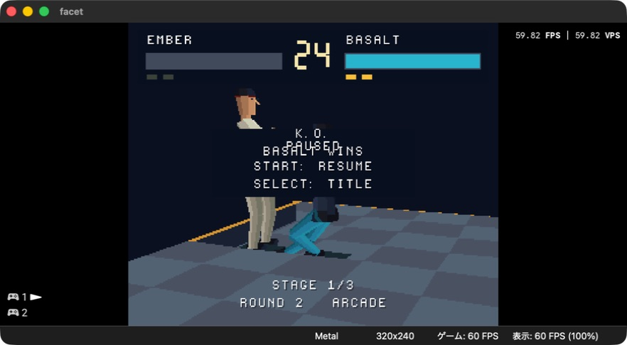

### 2P操作と描画余裕

2番パッドでキャラクター選択、STARTポーズ、移動を確認。右への移動を保持してリングアウトとなり、2ラウンド先取でPLAYER 1 WINSへ遷移した。エミュレーター内蔵マクロによるPS1パッド経路の確認で、物理コントローラー試験とは区別する。

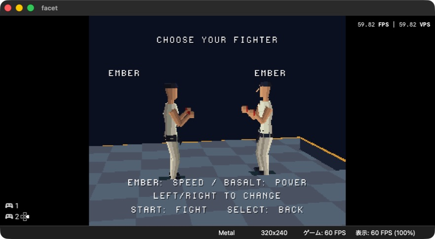

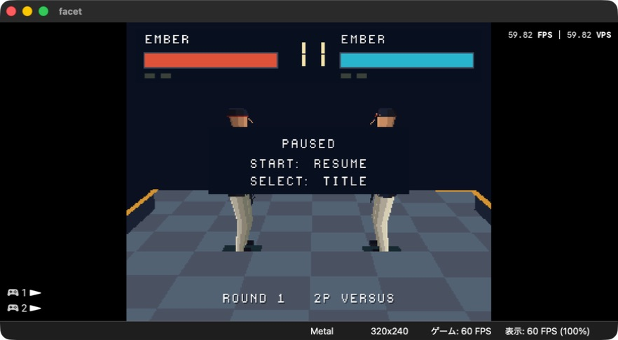

`fddb383` のCPU戦5試合は計9,338フレームで処理落ち0。ただし道着モデル同士の2P戦（ポーズを含む）は3,889フレーム中1回の2VBlank間隔が残った。床の共有頂点をフレーム内で使い回し、投影回数を256から81へ削減する。形状・面数・並び順は維持。切り分けが済んだパッド診断出力も撤去。

### 入力検証の追加証拠と現在の検証境界

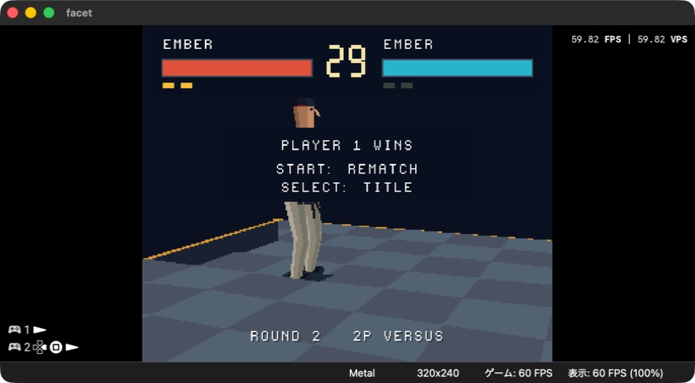

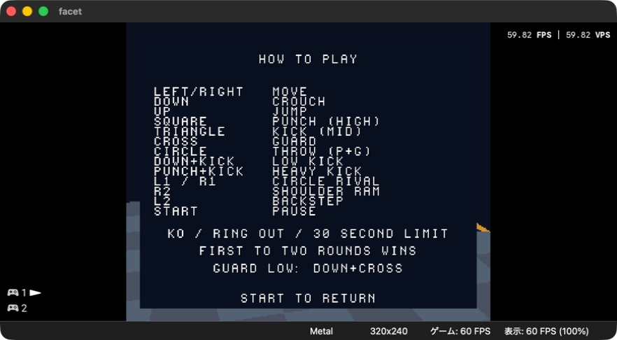

[対戦後にまとめて出力したフレーム計測](frame-audit-deferred.txt)。最初のCPU戦5試合、合計9,338フレームはすべて1VBlankだった。その後の対人操作テストとは区別する。

入力には[DuckStation公式実装の保持型マクロ](https://raw.githubusercontent.com/stenzek/duckstation/master/src/util/input_manager.cpp)を利用した。元の入力プリセットはローカルに保存。PS1入力処理自体は変更せず、タイトルから実際のパッド経路で検証した。

`3ce1d20` は[Actions run 33932139842](https://github.com/GOROman/gpt-6-astra-ps1-game-benchmark/actions/runs/33932139842) 成功。ダウンロードとチェックサム検証後、既存エミュレーター内で切り替え中にCUAが `noWindowsAvailable` となった。最新の床最適化とポーズ修正の画面確認は未完了。

### CPUの判断間隔

CPUが毎フレーム入力を抽選し直して相手の技へ即座に反応していたため、難易度1/2/3で12/10/8戦闘フレームごとに判断する方式へ変更。判断の間は入力を保持し、ヒットストップ中は判断時計も停止する。描画・戦闘シミュレーションは60Hzを維持する。判断間隔とラウンド間リセット、長時間の決定性をテストする。

最新床最適化を含む`3ce1d20`はエミュレーターで起動済み。アーケードのステージ2への遷移、道着モデル同士の描画を確認。

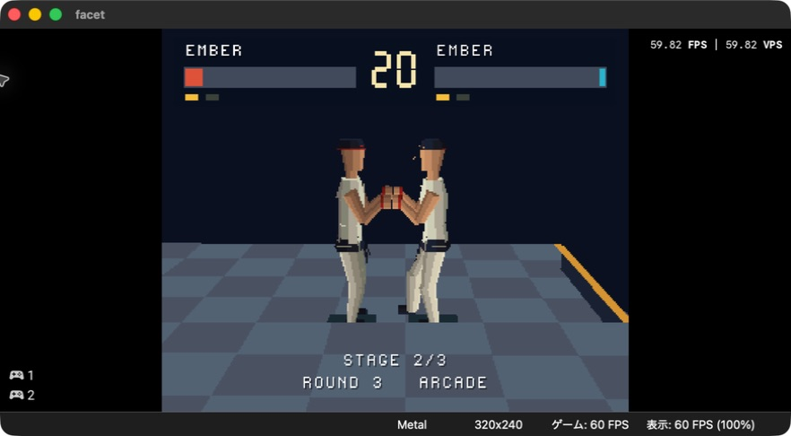
